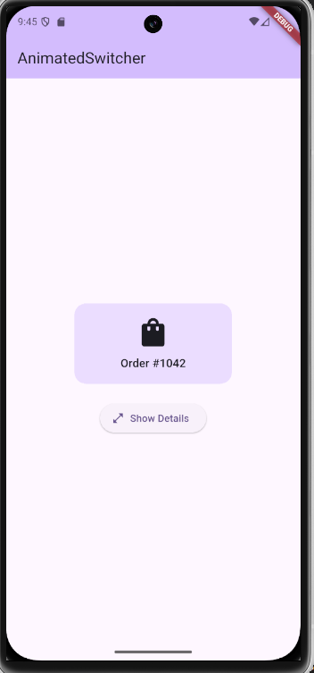
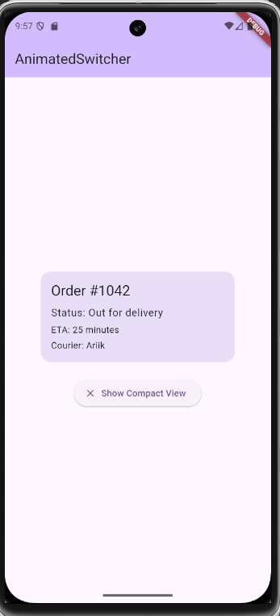

# Widget Presentation: AnimatedSwitcher

`AnimatedSwitcher` is a Flutter widget that smoothly animates from one child widget to another when the child changes.

## Assignment Context

This project is my in-class widget presentation demo for Flutter.  
Use case: a small order-tracking card that switches between compact and detailed views.

## Demo Summary (Real-World Scenario)

The app simulates a delivery status UI:
1. Compact card: shows order number and icon.
2. Expanded card: shows status, ETA, and courier name.
3. Button tap toggles the two states using `AnimatedSwitcher`.

This matches a realistic production flow where users reveal more details without navigating away.

## How To Run

```bash
flutter pub get
flutter run
```

## Relevant Code Location

- `lib/screen/home.dart`: `AnimatedSwitcher` demo and toggle logic
- `lib/main.dart`: app entry point

## Three AnimatedSwitcher Properties Demonstrated

### 1. `duration`
- In this project: `duration: const Duration(milliseconds: 200)`
- Default: `const Duration(milliseconds: 300)`
- What changes on screen: controls how quickly the new widget appears.
- Why a developer adjusts it: to make transitions feel faster or calmer depending on UX goals.

### 2. `transitionBuilder`
- In this project: custom builder combining `FadeTransition`, `SlideTransition`, and `ScaleTransition`
- Default: a basic `FadeTransition`
- What changes on screen: instead of only fading, the new card fades in, slides up, and scales from `0.85` to `1.0`.
- Why a developer adjusts it: to create a branded, expressive motion style for state changes.

### 3. `switchInCurve`
- In this project: `switchInCurve: Curves.easeOutCubic`
- Default: `Curves.linear`
- What changes on screen: motion starts quickly and settles smoothly at the end.
- Why a developer adjusts it: curve choice changes how natural or snappy an animation feels.

## Screenshots (Final UI)

### Compact View


### Expanded View


## In-Class Presentation Record

- Presentation date: March 12, 2026
- Presentation length target: 3 to 5 minutes
- Submission type: public GitHub repository link submitted on Canvas before 5:00 PM on presentation day

## Notes

- Code references are from Flutter documentation and class examples where applicable.
- Commit history should include meaningful messages (not one single final commit).
